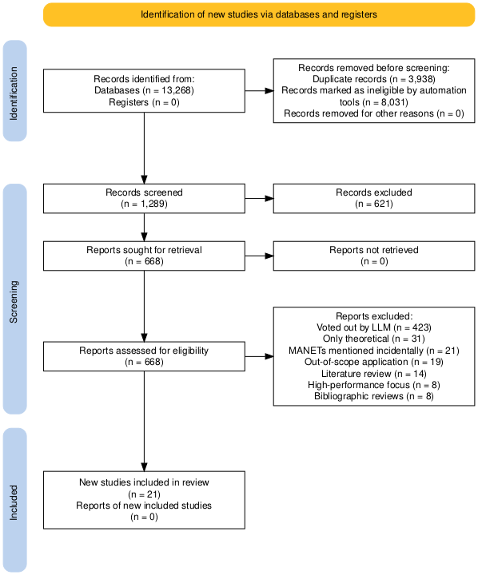
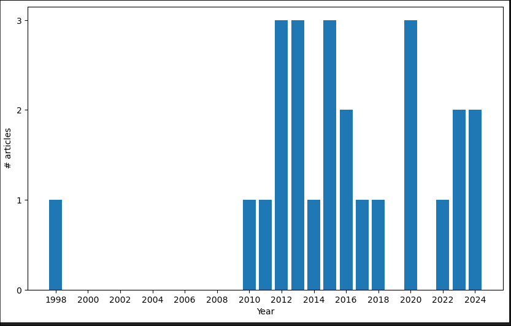
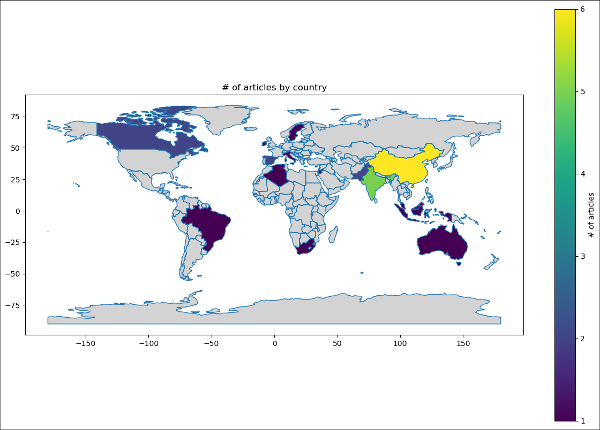
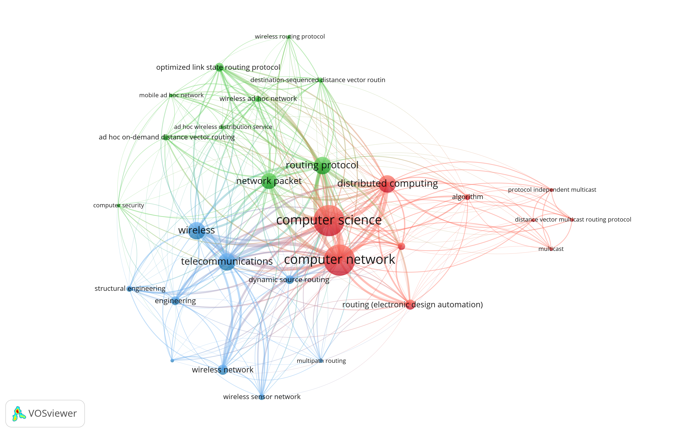

# Routing Algorithms in Wireless Ad-Hoc Mesh Networks: A Scoping Review

Generalov Daniil^1^

Peoples' Friendship University of Russia named after Patrice Lumumba, Moscow, Russian Federation

E-mail: 1032212280@pfur.ru

## Abstract

**Background**: Wireless ad-hoc mesh networks (MANETs) are an important area of IoT and networking research and development, because they enable the simple deployment of complex applications such as wireless sensor networks. However, for these applications to remain efficient and scalable, they require a routing algorithm to allow each node to forward messages to its neighbors. Despite the growing interest in IoT, it lacks a comprehensive mapping of existing routing protocols, which means authors need to develop their own criteria for evaluation.

**Purpose**: This scoping review aims to systematically explore and evaluate existing approaches to routing in wireless mesh networks. The review identifies key frameworks, approaches, and challenges to inform future research directions.

**Method**: Following the PRISMA-ScR guidelines, a systematic literature search was conducted in ScienceDirect and complementary databases. A total of 13,258 studies were initially identified, reduced to 21 relevant articles after screening based on eligibility criteria. Both qualitative and quantitative methods were used to synthesize findings, including routing algorithms and protocols, simulation environments and metrics, and real-world applications.

**Results**: The review highlights diverse approaches to routing in MANETs, like link-state routing, gossip routing, and more complex approaches like AODV. Several metrics are used to evaluate the routing algorithms, like end-to-end latency, packet delivery ratio, throughput, and power consumption. Several different simulation frameworks are used: they differ in whether the timesteps are discrete or continuous, whether the nodes have mobility or not, and what physical aspects of the nodes are simulated. However, there are significant gaps in real-world testing, with very few studies focusing on implementing their algorithms on physical hardware.

**Conclusion**: This review underscores the strengths and limitations of existing methodologies, emphasizing the need for standardized evaluation frameworks and robust real-world applications. Future research should focus on real-world implementations for the algorithms and protocols to perform field testing of MANET performance.

**Keywords**: MANET; wireless ad-hoc network; IoT; routing algorithms; scoping review

## Introduction

Wireless ad-hoc mesh networks (MANETs) are a comparatively new technology
that is typically deployed in IoT applications,
such as wireless sensor networks,
as well as in mobile robotics
such as UAVs and vehicle to vehicle communication.

MANETs are characterized by a dynamic topology,
where nodes can join and leave the network at any time.
This makes such networks challenging to reason about,
compared to traditional hub-and-spoke wireless networks
or to wired networks
(which both have predictable topologies, typically provided by tne network administrator).

The dynamic nature of MANETs poses a significant challenge
to traditional routing algorithms like BGP (Border Gateway Protocol),
which rely on static routing tables
and being able to exchange them with elective peers.
Because of this, many IoT applications choose to design their own routing protocols,
taking advantage of the dynamic nature of MANETs.
However, in the literature, there is a lack of consistent evaluation standards and metrics,
because different authors optimize their routing protocols for different constraints.

This review attempts to address this gap by systematically mapping existing methodologies and identifying gaps in research. Following the PRISMA-ScR [@prisma-src] framework, we synthesize findings on the existing routing protocols, evaluation metrics, and real-world applications. The review offers insights into the strengths and limitations of current techniques. The goal is to inform future developments in scalable, efficient, and adaptable MANET deployments, allowing their use in a wide range of IoT applications.

The primary objectives of this scoping review are:  
RQ#1. Highlight common approaches to routing in wireless mesh networks.
RQ#2. Identify strategies for route information exchange in MANETs.  
RQ#3. Determine what metrics are being used for evaluating routing algorithms.
RQ#4. Assess the effectiveness of different frameworks and strategies.

## Methods

### Protocol and Registration

This scoping review adheres to the guidelines set forth by the PRISMA-ScR
(Preferred Reporting Items for Systematic Reviews
and Meta-Analyses extension for Scoping Reviews)
framework to ensure transparency and systematic reporting.
The study's objective, research questions, eligibility criteria,
and search strategy were defined before initiating the data collection process.
The protocol was not registered in PROSPERO,
as scoping reviews fall outside the platform's registration scope.
Any deviations from the original protocol are be documented
in the "Limitations" section of the final manuscript.

### Transparency Statement

The study is conducted with full transparency,
and this section provides an accurate and detailed account of all methodological steps.
No significant aspects of the process are omitted,
and any methodological decisions are documented.
Any discrepancies between the original plan and the actual
review process are explicitly detailed in this report.

### Eligibility Criteria

The review follows the Population, Concept, Context (PCC) framework for eligibility criteria [@afc61c6cf471416489e36a4bc382d3b9].

This review includes studies that were focused on problems related to packet routing
in wireless mesh networks.
This includes a broad scope:
different considerations, such as resource constraints,
end-to-end latency, packet loss
and other factors are considered by various authors,
and in this review we must include all of them.
Additionally, mesh networks are deployed in IoT applications
as well as UAV and mobile robotics:
this affects the specifics of the routing problem,
so for the purposes of this review we had to decide what kind of problem to focus on.
We chose the former as the primary focus,
because IoT devices are more resource constrained
and require different routing considerations.

Both qualitative and quantitative primary research studies are eligible.
Editorials, commentaries, and opinion pieces as well as conference abstracts are excluded.

: **Table 1:** Inclusion/Exclusion Criteria

Criterion  | Inclusion | Exclusion | Justification
-----------|-----------|-----------|--------------
Population | Wireless Mesh Networks, especially ad-hoc and IoT | other kinds of networks, such as those using mobile phones | IoT devices have resource constraints, but are dedicated to the task, while mobile phones are less constrained and more capable devices, able to access information using the internet or with the help of the user. The concern with routing algorithms is primarily with the constraints of IoT devices.
Context    | IoT, autonomous robots and similar industrial applications | Emergency response networks, military operations, or urban infrastructure | The excluded scenarios can take advantage of satellite links, which are easier to manage than a full mesh network. By contrast, IoT devices are often installed in embedded, low-power applications, which means they cannot use a satellite connection.
Concept    | Routing protocols, dealing with changing and unknown network topology, fault tolerance | Techniques for improving throughput, such as multipath routing | For this study, we are concerned with reliability for applications which deal with small amounts of data. Performance improvements can be added later.
Language   | English | Others | English is the main language of scientific communication and the IT field
Time period | any | none | Collecting all possible sources
Types of sources | All research papers | Unavailable sources, reviews, editorials | Gathering all the primary sources possible
Geographical affiliation | Any location | None | No reason to believe that location influences the results

### Information Sources

The literature search was conducted primarily in ScienceDirect,
because it is an extensive repository of peer-reviewed
articles relevant to mesh networking and routing algorithms.
It is also a good candidate for this type of search because
it allows automated searches to be performed,
which helped collect large amounts of potential results.
Additional citation searches were performed to enrich this review with important studies,
that might have been missed by the database search.
The reference lists of included studies were manually
reviewed to identify other potentially relevant sources.

### Search Strategy

The search strategy was designed to systematically identify
articles that address routing in MANETs.
Initially, an exploratory search to determine broad patterns in the literature was made.
This foundational phase was useful for finding the search keywords,
ensuring that subsequent queries were relevant and accurate.
To enhance the effectiveness of the search,
techniques such as Boolean operators and truncation symbols were employed.
These methods helped us to select more synonymous keywords
and broaden the scope of the literature review.
The iterative nature of the search process allowed for continuous refinement,
adapting to the patterns and insights uncovered during the review.

By integrating both automated and manual search methods,
the strategy ensured a more thorough examination of the literature.
Ultimately, this search strategy provided a solid foundation for the review,
allowing us to identify a wide range of studies that address routing in MANETs.
z
The following search queries were used:

- mesh network AND routing
- wifi AND routing AND mesh
- wireless AND mesh network

### Selection of Sources of Evidence

The titles and abstracts of the retrieved articles were screened by one reviewer.
Articles that are identified as potentially meeting the inclusion/exclusion criteria
were advanced to the full-text review.
Additionally, to focus the review on the most relevant studies,
an AI approach was used in the filtering process:
the titles and abstracts were submitted into a LLM,
along with the inclusion/exclusion criteria,
and the LLM was asked to say whether the article seemed to match the criteria.
The same question was asked five times with random, but deterministically generated seed values;
each response was a vote for inclusion or exclusion.
If there was a clear majority for exclusion, then the paper was skipped;
otherwise, in the case of a majority for inclusion or a tie,
the paper was advanced to the full-text review.
The full-text articles were also assessed by the one reviewer.

The final results of the search, including the number of articles screened,
included and excluded at each stage was illustrated in a PRISMA flow diagram,
as recommended by the PRISMA-ScR guidelines. This is visually represent
the study selection process and ensure adherence to reporting standards.

### Data Charting Process

Data was extracted by one member of the research team into spreadsheet software
following guidelines from JBI [@afc61c6cf471416489e36a4bc382d3b9].
The extracted data included study characteristics
and answers to selected research questions.

### Data Items

### Synthesis of Results

#### Collating and Summarising the Results

The initial analysis involved both quantitative and qualitative approaches.
A descriptive numerical summary of the studies was conducted,
covering aspects such as the number of studies, publication years, study populations,
and key methodologies used.
A deductive content analysis was then performed based on the research questions,
and a narrative summary accompanies the tabular results.

#### Reporting

Results are reported in line with the PRISMA-ScR guidelines.
A PRISMA flow diagram illustrates the study selection process,
including reasons for exclusion during the full-text review.
Quantitative results are presented in tables and organized in a narrative summary
aligned with the research questions.

## Results

### Selection of Sources of Evidence

A total of 13,258 studies were identified through the ScienceDirect database
using the search queries specified in this review.
After removing duplicates, 3938 duplicate entries (29.70%) were excluded,
resulting in 9350 unique records.
Automation tools were used to remove 8031 studies (86.16%) deemed ineligible based
on irrelevance to the topic or lack of sufficient empirical or theoretical data on
multi-agent systems and cooperation and conflict solving within them.
The titles and abstracts of the remaininng 1289 (13.83%) studies were
screened in accordance with the inclusion and exclusion criteria:
668 (51.82%) remained after manual keyword filtering,
and that was further reduced to 245 (19.00% of the total, 36.67% of the previous)
using five votes from the LLM (as described above).
Finally, the remaining abstracts were reviewed manually in full,
leaving a total of 122 records for full-text screening.

Upon further examination, 101 studies (82.78%) were excluded for the following reasons:

- 31 studies focused solely on the theory of routing algorithms, without providing a concrete implementable solution;
- 21 studies were focused on other considerations of IoT devices, such as simultaneous localization and mapping (SLAM) for mobile robotics. Such studies only mentioned MANETs incidentally, as a tool to solve their main focus, and are therefore out of scope;
- 19 studies addressed use-cases such as disaster recovery or military operations, which are out of scope because of this review's focus on low-power, resource-constrained devices such as wireless sensor networks, while these specific applications typically involve devices with higher capabilities;
- 14 studies were systematic literature reviews without detailed methodological insights;
- 8 studies had a focus on high-performance mesh networks, which are out of scope because high data rate is not compatible with the low-power and resource-constrained embedded environments we're considering;
- 8 studies were bibliographic reviews without original empirical findings;
- Finally, a total of 21 studies (0.002% of the total records) were included in this review.

Together these 21 studies provided relevant empirical data, theoretical frameworks,
and insights into routing algorithm design and implementation for MANETs.

#### Timeframe Analysis

The articles gathered span a time range between 1998 and 2024,
though almost every article is younger than 2010.
The most articles published in a single year was three:
this happened in 2012, 2013, 2015 and 2020.
This shows that the field was being considered in the late 1990s,
but has only gotten significant advancement since the 2010s,
when the equipment to support MANET-like wireless deployments became widely available.

#### Geographical Distribution of Publications

The largest single source of publications is China, with 7 articles included.
The next is India, with 5 articles,
then Pakistan, Canada and Spain each have 3,
and the rest of the highlighted countries have 1 each.

For simplicity, we consider only the primary author's affiliation,
however some of the articles have authors from other places,
so this is not an exhaustive list of all authors:
for example, some of the articles have co-authors from the US,
however these are not shown on the figure below.

### Defining Current Trends

By using the VOSviewer application to analyze the keywords in the articles,
three main clusters emerge:

**Computer science:** This cluster (in red) focuses on the theoretical foundations of computer science,
such as algorithms
(particularly in "distributed computing", which is a central node).
Certain network-related keywords (such as "multicast") can also be found here,
because those are needed as the basic building block of several theoretical frameworks.

**Routing:** This cluster (in green)
is focused on the specific problem of routing "network packets"
using a "routing protocol",
such as the "optimized link state routing protocol".
This particular protocol is a fairly popular choice for a
"wireless ad-hoc network",
so a relatively strong link can be found there.

**Telecommunications:** This cluster (in blue)
is concerned with the practical problems
involving connecting computer systems together.
Here we can find the keyword "wireless",
which is only found as part of other keywords in the other clusters.
Additionally, "engineering" (particularly "structural engineering")
is a concern here, because a particular focus is placed
on the physical design of buildings to allow them to carry wireless signals.

These clusters are densely connected together,
because (for example) there isn't a bright line separation between routing in particular from telecommunications in general.
This is why there are strong links betweeen
"wireless", "routing protocol", "telecommunications" and "network packet":
these concepts are all to do with each other, and aren't necessarily able
to be cleanly separated out.
Similarly, while "distributed computing"
is most strongly associated with "computer science" and "computer network",
it also has a fairly strong link to "network packet",
because distributed computing applications need to have a good understanding of the physical packet-switching infrastructure underlying them.
Finally, concepts like "engineering",
while not being central in the diagram,
are still fairly important,
which highlights the fact that the theoretical foundations
of MANETs and mesh networks
are being used in real-world applications.

### Synthesis of Results

#### Methodology details

##### IoT hardware

Across many studies, there is a strong preference for wireless sensor nodes and low-power embedded systems, often adhering to common standards such as IEEE 802.15.4 and IEEE 802.11. For instance, @KRENTZ202457 uses devices based on the IEEE 802.15.4 standard, which is known for its suitability in low-power, low data-rate environments. @SAIF2015404 and @KABIWA20131108, on the other hand, rely on a MAC layer provided by IEEE 802.11 (better known as Wi-Fi), which works with higher power and higher data rates (of the kind that can be used for more complex devices like smartphones and laptops): indeed, the focus of these articles is more on approaches to increase data transfer speeds.
Several papers --- such as @SHARMA2013416 and @VENKATESHA201537 --- utilize mobile and static sensor nodes typically used in environmental and industrial monitoring scenarios. Similarly, @HECK2025110364 and @HASAN2018454 focus on smart meters and energy grid-specific routers, reflecting the growing integration of IoT in energy infrastructure.
Simulation-based studies such as @DIIANNI1998131, @LI2011458, and @LIU201321 do not rely on any particular physical device design, but instead simulate mobile ad-hoc nodes with capabilities representative of real-world IoT deployments.
Additionally, articles like @CHARLES20201819 simulate specific, real-world IoT devices (e.g., Tmote Sky motes) using environments like the Contiki Cooja simulator, thereby focusing on standardized, commercially available, replicable hardware platforms.
Common across these studies is the use of devices characterized by low power consumption, short-range wireless communication, support for mesh or ad-hoc networking and suitability for constrained environments (e.g., industrial sites, smart grids, environmental sensing).
This convergence highlights a shared understanding of the hardware constraints and network conditions under which routing protocols must perform, reinforcing the relevance of standardized, low-power IoT devices in the research landscape.
It 

##### Main network routing considerations

A cross-analysis of the reviewed articles reveals several recurring considerations that are central to the design and evaluation of routing protocols in mobile ad-hoc networks. The most prevalent themes are energy efficiency, mobility handling, convergence speed, network scalability, and security concerns.
Energy efficiency emerges as a dominant concern, especially in resource-constrained environments (which are key to this review). Articles such as @KRENTZ202457 underscore the need to minimize power consumption to prolong network lifetime, defined as the time that nodes can work as routers on a single battery charge. These works focus on minimizing retransmissions, reducing route maintenance overhead, and selecting energy-aware routes.
Mobility management is another critical consideration in dynamic environments, where nodes can move around and affect route stability. This is prominently discussed in studies like @SHARMA2013416, which introduce mobility-aware adaptations and recovery mechanisms to maintain reliable communications under node movement.
This is related to convergence speed and stability, which are emphasized in articles such as @LI2020570, where rapid route discovery and adaptation are essential to support real-time applications and minimize packet loss. The need for protocols to quickly adapt to topological changes is also evident in @HECK2025110364.
Scalability of routing mechanisms is another common theme, particularly in large or dense network deployments (like wireless sensor networks, which can have tens of nodes per room and thousands per building). Articles like @ALVAREZ2008240 point to hierarchical structures and cross-layer designs as methods to handle increased routing overhead without sacrificing performance.
Security and privacy considerations are addressed in protocols like SMOR, presented in @KRENTZ202457, where secure multipath routing counters data tampering and eavesdropping risks. Ensuring secure route discovery and data transmission is particularly emphasized in scenarios involving sensitive or mission-critical data; however, this is not a common focus in the reviewed articles.
This shared focus on energy efficiency, adaptability to mobility, rapid convergence and scalability reflects a consistent set of priorities shaping the evolution of routing protocols in wireless and mobile ad-hoc networks.

##### Used algorithms

The algorithms discussed in the reviewed articles exhibit a broad spectrum of applications, but are tailored to specific domains within wireless communication networks. A recurring focus is the optimization of routing in MANETs, particularly under constraints such as security, energy efficiency, and dynamic topology changes. For instance, the Sorting Ant protocol introduced in @LI2020570 is designed specifically for MANETs and emphasizes secure, fault-tolerant communication in smart grid environments. Similarly, @PAN2012952 targets MANETs with an emphasis on multicast support and dynamic topologies.
Another prominent domain is low-power and lossy networks (LLNs) and wireless sensor networks (WSNs), often deployed in environmental monitoring or urban infrastructure. The algorithm in @KRENTZ202457 focuses on LLNs within industrial automation systems, balancing security with energy-efficient multipath routing. This is echoed by @SHARMA2013416, which addresses the mobility of sinks in WSNs, a common challenge in field deployments such as agriculture or environmental sensing (where the sensors stay in place but the receivers, perhaps attached to vehicles, move around to collect data).
On the other end of the scale, high-mobility networks need different approaches, and algorithms like AODV and their improvements [@LIU201321] are well suited for this.
Smart city and utility-oriented applications appear frequently, particularly in algorithms designed for Wi-SUN FAN and Bluetooth Low Energy (BLE) Mesh networks. The Fast Routing Recovery (FRR) mechanism proposed in @HECK2025110364 is tailored to Wi-SUN FAN networks used in smart metering, where minimizing packet loss is critical for reliable data transmission. Similarly,@HERNANDEZSOLANA2022109114 focuses on BLE Mesh networks, optimizing for energy conservation and delay tolerance in IoT deployments.
Across these articles, common themes include the adaptation of routing protocols to the physical and application-specific constraints of the network, such as node mobility, power availability, and the need for secure communication. The majority of algorithms are tailored for static or semi-static deployments, though there is growing attention to mobile and delay-tolerant contexts, particularly in WSNs and mesh topologies. Articles such as @LI2011458 demonstrate that strategies involving multi-path and multi-channel routing are favored for enhancing robustness and throughput in such networks. The key takeaway is that none of the listed articles are using traditional routing algorithms like BGP, RIP or OSPF (which are the standard protocols for static IP networks that make up the Internet): instead, the specific problem constraints lead authors to develop new algorithms that are tailored to the needs of the domain.

#### Measuring outcomes

##### Simulator software

Simulation was the predominant evaluation method across the articles. Most studies employed the Cooja network simulator alongside the Contiki-NG OS [@KRENTZ202457; @HECK2025110364]. The @SHARMA2013416 paper conducted simulations with 40 mobile nodes within a 100m² environment to assess dynamic routing reliability. NS2 and NS3 were also used in several studies to simulate static mesh topologies and evaluate convergence speeds.
Several authors opted to develop their own network simulator software for their task [@PAN2012952]. This can be helpful for rapid prototyping,
but limits the options for reproducibility and cross-comparability of results.
Other lesser-used simulators were TOSSIM (which is a simulator for TinyOS applications, TinyOS being an embedded operating system for low-power wireless applications), 
which was used in @KAFI2014181.
@ALVAREZ2008240 lacked specific simulation software but provided both theoretical and simulation-based evaluation strategies.

##### Field testing

None of the included studies reported extensive real-world field testing; instead, they relied on simulation environments to replicate field conditions. However, the simulation parameters were often carefully selected to approximate realistic scenarios -- such as urban layouts or mobile node trajectories. One study [@VENKATESHA201537] even selected specific energy budgets and costs for sending radio messages (specifically, every node has 5J stored in the battery and spends 0.0255J per transmission),
and another [@KRISHNA2016817] includes joule numbers in its final results.

Only one study, @MUHENDRA2017332, mentioned true hardware field testing,
using a small, custom-built device consisting of an ATmega328p microcontroller and a ESP8266 WiFi module. Such a device can be a component of an IoT solution for a smart home
or similar application, so the fact that the mesh network functioned (with workable performance characteristics, such as an average data rate of 110kbps)
means that it's possible to deploy such tests with commodity hardware.

##### Specific considerations for algorithm usage scope

Each algorithm was tailored to a specific domain or constraint profile. For example, SMOR was optimized for low-power lossy networks (LLNs), making it ideal for smart home or remote monitoring applications. FRR was explicitly designed for Wi-SUN FAN networks, relevant in smart grid infrastructures. The FNA-CTP algorithm was intended for highly mobile WSNs, particularly in vehicular or emergency response contexts. The Fortified Ant protocol targeted MANETs, emphasizing secure, multi-path routing suitable for semi-static deployments. Meanwhile, the layered approach in @ALVAREZ2008240 was designed for static sensor networks, with special application in environmental data collection.

Because energy is at a premium, some of the algorithms have multiple classes of nodes.
For example, in @ZHENG2020443 (where a wireless sensor network is deployed) there are Sensor Nodes which just collect and send data,
Cluster Nodes which form the mesh backbone
and Cluster Heads which hold routing information
and are elected by their energy level.
Similarly, in @LI2020570, the traditional ant colony protocol is enhanced into Fortified Ant with the addition of
Elite Ants, which influence the routing more than neighboring nodes.
Discriminating between nodes like this allows simpler, less powerful nodes to 
only care about their own data and not have to worry about managing routing information for other nodes.
(Some of the papers, such as @ALI2024102356, are actually primarily focused on the election phase, because improvements
in the selection of leader nodes translates to improvements in routing quality across the network.)

The theoretical approach described in @DIIANNI1998131 is perhaps the most flexible of all reviewed articles, because it applies for any packet-switched network -- wired or wireless -- and the article is focused on delay and bandwidth constraints, which are invariably present in all real-world deployments. However, that paper's conclusion is that generalized packet routing is not solvable efficiently in polynomial time (i.e. it is an NP-class problem). This basically means that either end-to-end packet delays, or bandwidth, or even both, have to be sacrificed in real-world deployments of MANETs, and all the other articles deal with this limitation in some form or another.

#### Evaluation metrics and targets

Across the reviewed studies, a range of simulation environments and performance metrics have been employed to assess the effectiveness of routing algorithms in MANETs. Commonly used simulation tools include NS-2, NS-3, Cooja with Contiki-NG OS, as well as custom environments, often modeling static topologies or mobile topologies under randomized movement patterns. Metrics used to evaluate performance exhibit consistency across the literature, focusing heavily on PDR, end-to-end delay, energy consumption, control overhead, and network convergence time.
@KRENTZ202457 demonstrates comprehensive evaluation using Cooja and Contiki-NG under dynamic and static network conditions, highlighting metrics such as PDR, delay, energy consumption, and memory footprint. The proposed SMOR algorithm achieved significant reliability and latency improvements, with high resilience and security enhancements (e.g., resistance to spoofing and denial-of-sleep attacks).
Similarly, @HECK2025110364 uses Cooja to measure network formation time and energy efficiency, achieving up to 50% faster recovery after network resets while maintaining a low duty cycle.
Some articles focus more on throughput and delay metrics, leveraging multi-path strategies to minimize multicast latency and enhance transmission capacity [@LI2011458; @KUMAR2012481].
Energy efficiency also emerges as a prominent benefit across studies. For instance, @HERNANDEZSOLANA2022109114 reports up to 99.24% energy savings via analytical modeling, which is achieved by keeping radios inactive for longer periods of time. Likewise, @PAN2012952 highlights improvements in both PDR and delay, particularly in multimedia traffic scenarios.
The other studies either adopt theoretical evaluation or focus on qualitative analysis, but almost all emphasize advantages like architectural simplicity and delay reduction [@ALVAREZ2008240; @DIIANNI1998131].

Despite variations in testbeds and protocols, certain patterns are clear:

- PDR is the most frequently reported metric, often tied to claims of improved reliability.
- Delay (end-to-end latency) and network convergence time are commonly used to assess responsiveness and adaptability.
- Energy consumption is a dominant metric in sensor and IoT-focused research, particularly in large or resource-constrained deployments.
- Control overhead is used to assess efficiency, especially in protocols with reactive or hybrid designs.
- Simulation platforms (e.g., NS2, NS3, Cooja, TOSSIM) are favored for flexibility, and very few studies incorporate real-world testing.

Across all reviewed articles, proposed algorithms consistently report benefits in terms of reliability, efficiency, and scalability—often through multi-path routing, opportunistic forwarding, and mobility-aware strategies. Notably, most improvements are incremental, building upon existing protocols (like RPL, AODV, or CTP) with enhancements tailored to specific scenarios such as mobility, energy savings, or fast recovery.

## Discussion

### Summary of evidence

The reviewed literature emphasizes the importance of low-power hardware platforms in mesh network routing research, especially those that follow standards like IEEE 802.15.4 and IEEE 802.11. These platforms -- both general-purpose, commercial devices and custom-built sensor nodes -- represent the limited energy, bandwidth, and processing capabilities typical of IoT environments. Simulated environments such as Cooja and NS2/NS3 are commonly used to model real-world network conditions, offering a balance between experimental control and realism.

Routing protocol design across the reviewed studies is shaped by a common set of priorities, particularly energy efficiency, support for mobility, scalability, and fast convergence. Energy efficiency stands out as a key concern due to the limited battery life of sensor nodes. Many papers propose routing methods that minimize retransmissions, reduce route maintenance costs, and use energy-aware path selection metrics. Mobility support is also important, especially in scenarios where the nodes can move around the environment (and particularly when this movement is not controlled by the network). Protocols that quickly adapt to changes in network topology or include recovery mechanisms tend to show better reliability and packet delivery under mobile conditions.

Although routing algorithms differ in structure and focus, they are all tailored to meet the specific needs of their intended applications. Examples such as SMOR, FRR, and Fortified Ant address challenges in LLNs, Wi-SUN FANs, or mobile ad-hoc networks respectively. Several protocols use hierarchical or role-based approaches—such as cluster head selection or elite ant models: this allows them to manage network load and balance energy use. Notably, none of the surveyed algorithms rely on traditional Internet routing protocols like BGP or OSPF. Instead, they adopt custom approaches that better suit the dynamic and decentralized nature of mesh and sensor networks.

Simulation remains the main method for evaluating protocol performance. Tools like Cooja, NS2/NS3, and TOSSIM are widely used, though some studies also use custom-built simulators. Common performance metrics include PDR, end-to-end delay, energy consumption, and control overhead. Most papers report improvements over existing baseline protocols. Because different routing strategies target different IoT use cases, each study tends to focus on a specific set of metrics: some prioritize PDR, others emphasize network convergence time, and some aim to reduce energy use at the cost of data throughput. While hardware-based testing is rare, simulations are often tuned with realistic parameters of battery and energy constraints to reflect real-world conditions more accurately.

In summary, the literature shows a clear trend in MANET research: routing protocols are becoming more adaptive, lightweight, and context-aware, shaped by the specific needs of IoT deployments. Although many of the proposed solutions build incrementally on existing work, they contribute meaningful improvements in reliability, efficiency, and scalability for energy-constrained, dynamic networks. The field remains heavily focused on simulation, and there are future research opportunities in standardizing evaluation methods and expanding real-world testing.

### Limitations

Several potential limitations of the existing studies can be identified.

#### Lack of Uniform Evaluation Standards

The lack of uniform cross-domain evaluation metrics across studies
poses a challenge for meaningful comparisons.
In one paper, the most important metric is the packet delivery ratio,
and in the next, it's network convergence time (and packets are permitted to be lost):
when optimizing for these two different factors,
it's difficult to compare the two networks' performance,
and almost impossible from the data contained in the paper itself,
as there is little overlap between the two sets of metrics.
One would need to run the simulations side-by-side to compare metrics that are more specific to the particular application,
but this is made difficult by the fact that different researchers have chosen different simulation testbeds.

#### Dependence on Simulation-Based Evidence

A significant proportion of evidence in the reviewed studies comes
from simulations rather than real-world implementations.
While simulations offer controlled testing,
they may not fully capture the challenges of deploying wireless meshes
in real-world scenarios.
In particular, wireless signals in the non-licensed radio ranges
are frequently affected by interference from other devices,
and it's difficult to simulate this in software other than
by simply dropping packets,
while real-world interference signals can be mistaken for packets of their own.

Addressing these limitations in future studies
through broader inclusion criteria, standardized metrics, and integration
of real-world case studies can enhance the review’s comprehensiveness and relevance.

## Conclusion

This scoping review provides a systematic examination of
the algorithms and other approaches involved in routing in wireless
mesh networks.
The findings highlight the strengths and limitations of current approaches:
while the suggested methods appear promising in computer simulations,
gaps remain in evaluation criteria and field testing.

The study emphasizes the need for standardized benchmarks and performance metrics to ensure comparability between different mesh network implementations.
Additionally, most of the current approaches seem focused on fixed or low-mobility networks,
and additional work is needed for implementations for higher-mobility applications
like swarm robotics.

By identifying research gaps and synthesizing existing approaches, this review provides a foundation for further exploration, which will help ensure
that wireless mesh networks can effectively address the goals of real-world IoT applications.

## References

::: {#refs}
:::
